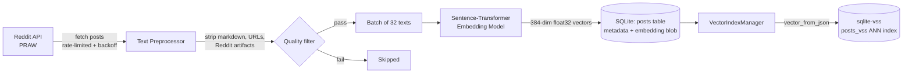
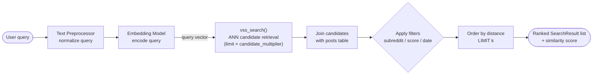

# Reddit Semantic Search

A semantic search engine over Reddit content, built on `sqlite-vss` for vector similarity search and `sentence-transformers` for embeddings. Ingests posts from any subreddit, embeds them locally, and supports meaning-based search, faceted filtering, "find similar posts," and cross-subreddit relevance analysis — all on top of a single SQLite file, no external vector database required.

## Why this exists

Keyword search on Reddit misses intent. Searching "deep learning for edge devices" won't surface a post titled "running small neural nets on a Raspberry Pi" even though it's exactly what you want. This project embeds post content into dense vectors and retrieves by similarity instead of literal token overlap, turning scattered subreddit browsing into a queryable personal knowledge base.

## Architecture

The system splits into two independent paths: an **offline pipeline** that builds the knowledge base, and an **online path** that serves queries against it. This separation means ingestion (slow, API-rate-limited, batch) never blocks search (fast, local, interactive).

### 1. Knowledge base construction (offline / batch)



### 2. User query flow (online / interactive)



**Design choice: SQLite + sqlite-vss over a dedicated vector DB.** For a personal/single-user knowledge base, running Pinecone/Weaviate/Milvus is overkill — extra infra, extra ops, extra latency for no benefit at this scale. `sqlite-vss` gives ANN vector search with zero additional services, while keeping metadata (score, subreddit, timestamps) in the same transactional store as the vectors, so filtered search is a single SQL query instead of a fan-out across two systems.

## Core components

| Component | Responsibility |
|---|---|
| `RedditClient` | Wraps PRAW with rate limiting (delay-based throttling) and exponential retry on `429`s. Enforces read-only credentials. |
| `TextPreprocessor` / `ContentPreparer` | Strips markdown, URLs, Reddit-specific artifacts (`[removed]`, `/r/`, `/u/` links, HTML entities), and filters low-signal content before it reaches the embedding model. |
| `EmbeddingGenerator` | Loads a `sentence-transformers` model (default `all-MiniLM-L6-v2`, 384-dim), auto-selects CUDA / MPS / CPU, and (de)serializes vectors to/from raw `float32` bytes for compact SQLite storage. |
| `KnowledgeBaseStorage` | Owns the SQLite connection, schema, and upsert logic (`INSERT ... ON CONFLICT DO UPDATE`) for posts and their embeddings. |
| `RedditIngestionPipeline` | Batches fetch → clean → embed → store, so embedding inference runs on batches of 32 rather than one post at a time. |
| `VectorIndexManager` | Builds and populates the `sqlite-vss` virtual table (`vss0`) from stored embeddings; supports index rebuilds. |
| `SemanticSearchEngine` | Query embedding + ANN candidate retrieval + SQL-side filtering (subreddit, score, date range), plus faceted search, similar-post lookup, and cross-subreddit relevance scoring. |

## Features

- **Semantic search** — natural-language queries matched by meaning, not keywords.
- **Faceted search** — result breakdowns by subreddit and score tier.
- **"More like this"** — find posts similar to a given post, optionally excluding its own subreddit.
- **Cross-subreddit analysis** — rank which subreddits are most relevant to a query, aggregated by similarity score.
- **Filtered retrieval** — combine vector similarity with structured filters (subreddit, minimum score, date range) in one query via an over-fetch-then-filter candidate strategy.
- **Idempotent ingestion** — re-running ingestion on the same subreddit upserts rather than duplicates.
- **Batched embedding inference** — amortizes model overhead across posts instead of per-row calls.

## Tech stack

- **Python 3** — `sqlite3`, `numpy`
- **[PRAW](https://praw.readthedocs.io/)** — Reddit API client
- **[sentence-transformers](https://www.sbert.net/)** — text embeddings (`all-MiniLM-L6-v2` by default)
- **[sqlite-vss](https://github.com/asg017/sqlite-vss)** — approximate nearest-neighbor vector search as a SQLite extension
- **PyTorch** — embedding inference backend (CUDA / Apple MPS / CPU auto-detected)

## Setup

### 1. Install dependencies

```bash
pip install praw sentence-transformers numpy torch
```

### 2. Download the sqlite-vss extension

Grab the `vector0` and `vss0` shared library files for your platform from the [sqlite-vss releases](https://github.com/asg017/sqlite-vss/releases) and place them in the project directory (or point `extension_path` at wherever you keep them).

### 3. Reddit API credentials

Create an app at [reddit.com/prefs/apps](https://www.reddit.com/prefs/apps) (type: `script`) to get a client ID and secret. Set them as environment variables rather than hardcoding them:

```bash
export REDDIT_CLIENT_ID="your_client_id"
export REDDIT_CLIENT_SECRET="your_client_secret"
export REDDIT_USER_AGENT="python:reddit_kb:v1.0 (by /u/your_username)"
```

## Usage

```python
from app import (
    create_database, EmbeddingGenerator, KnowledgeBaseStorage,
    RedditClient, RedditIngestionPipeline, VectorIndexManager,
    SemanticSearchEngine,
)

# 1. Set up storage + embedding model
conn = create_database("reddit_knowledge.db", extension_path=".")
conn.close()

embedder = EmbeddingGenerator("all-MiniLM-L6-v2")
storage = KnowledgeBaseStorage("reddit_knowledge.db", ".", embedding_dim=embedder.dimension)

# 2. Ingest a subreddit
reddit = RedditClient(client_id="...", client_secret="...", user_agent="...")
pipeline = RedditIngestionPipeline(reddit, storage, embedder)
pipeline.ingest_subreddit("MachineLearning", sort="top", limit=100, time_filter="month")

# 3. Build the vector index
index_manager = VectorIndexManager(storage)
index_manager.create_index()
index_manager.populate_index()

# 4. Search
search_engine = SemanticSearchEngine(storage, embedder)
results = search_engine.search("deep learning for edge devices", limit=5)
for r in results:
    print(f"[{r.subreddit}] {r.title}  (similarity={r.similarity_score:.3f})")
```

Or run the full demo end-to-end:

```bash
python app.py
```

This ingests `r/MachineLearning`, `r/Python`, and `r/DataScience`, builds the index, and runs example semantic, filtered, and cross-subreddit queries.

## Engineering notes

- **Reliability** — Reddit API calls go through rate limiting and exponential backoff (`2^attempt * 10s`, capped at 300s) on `429` responses, with the delay itself adapting upward after repeated throttling.
- **Storage efficiency** — embeddings are stored as raw `float32` bytes (not JSON or pickled arrays), keeping the `posts` table compact; they're converted to JSON only transiently when populating the `vss0` index, which requires that format.
- **Query strategy** — filtered search over-fetches ANN candidates (`limit * candidate_multiplier`) before applying SQL `WHERE` filters, since `sqlite-vss` filters post-retrieval rather than pre-retrieval; this trades a wider initial scan for correct filtered top-k results.
- **Idempotency** — ingestion is safe to re-run; `post_id` is unique, and re-ingesting updates score/comment counts and refreshes embeddings rather than creating duplicates.
